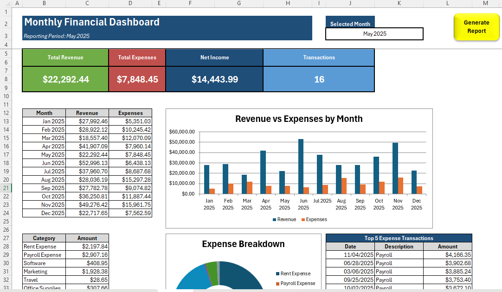
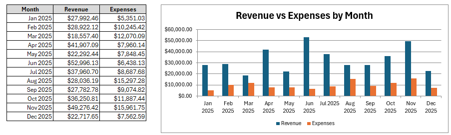
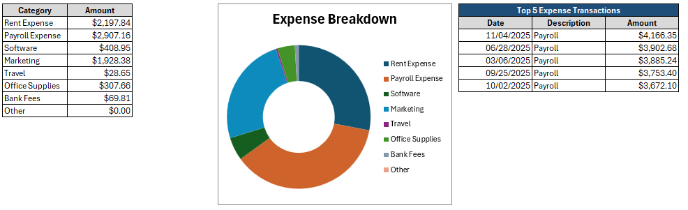
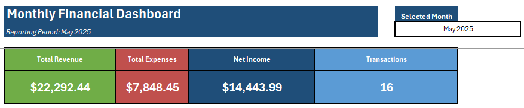

# Financial-Dashboard-Automation
Excel VBA solution for automating account reconciliation and exception reporting.

## Overview

This project is an Excel and VBA-based financial reporting automation system that transforms raw transaction data into a dynamic monthly management dashboard.

The solution was designed to eliminate the manual effort typically required to summarize financial activity, categorize transactions, and prepare monthly reporting packages. With a single refresh, users can convert hundreds of transactions into meaningful financial insights within seconds.

The dashboard allows users to select a reporting month and instantly view revenue, expenses, net income, transaction volume, and spending trends.

---

## Business Problem

Finance teams frequently receive large transaction exports from accounting systems, banks, credit card providers, or ERP platforms.

Preparing monthly reporting often requires:

* Cleaning transaction data
* Categorizing expenses
* Summarizing revenue
* Creating management reports
* Building charts and dashboards

These repetitive tasks consume valuable time each month and increase the risk of manual errors.

This project automates that process and provides management-ready reporting with minimal user effort.

---

## Solution

This Monthly Financial Dashboard Automation System converts raw transaction data into a structured reporting model and automatically generates key financial metrics.

Users simply provide transaction data and select a reporting month. The dashboard performs the calculations and displays the results virtually instantly.

---

## Key Features

### Automated Data Processing

* Imports and organizes transaction-level data
* Standardizes reporting information
* Prepares data for analysis

### Transaction Categorization

* Assigns transactions to reporting categories
* Separates revenue from expenses
* Supports management reporting and budgeting analysis

### Monthly Reporting Dashboard

* User-selected reporting period
* Dynamic financial summaries
* Automated KPI calculations

### Revenue Analysis

* Total revenue by month
* Revenue trend visibility
* Reporting-period comparisons

### Expense Analysis

* Total expenses by month
* Expense category breakdowns
* Spending trend identification

### Financial Performance Metrics

* Net income calculation
* Transaction volume reporting
* High-level business performance indicators

### Reusable Reporting Framework

* Refreshable with new transaction datasets
* Scalable for future enhancements
* Repeatable month-end reporting process

---

## Technologies Used

* Microsoft Excel
* Visual Basic for Applications (VBA)
* Financial Reporting Automation
* Dashboard Design
* Data Transformation
* Formula-Based Analytics

---

## Business Value

This solution demonstrates how routine financial reporting processes can be automated using Excel and VBA.

Benefits include:

* Reduced manual reporting effort
* Faster month-end analysis
* Consistent reporting structure
* Improved visibility into financial performance
* Reusable reporting framework for future periods

---

## Skills Demonstrated

* Excel Development
* VBA Automation
* Financial Reporting
* Dashboard Design
* Data Analysis
* Business Process Improvement
* Accounting Systems Thinking

---

## Sample Use Cases

* Small business financial reporting
* Department expense analysis
* Budget monitoring
* Management reporting
* Month-end financial review
* Accounting process automation

---

## Future Enhancements

* Automated transaction categorization using rules
* Power Query integration
* Power BI dashboard version
* PDF report generation
* Email report distribution
* Multi-company reporting support

---

## Screenshots

### Dashboard Overview

### Revenue and Expense Summary

### Expense Category Analysis

### Monthly Reporting View

